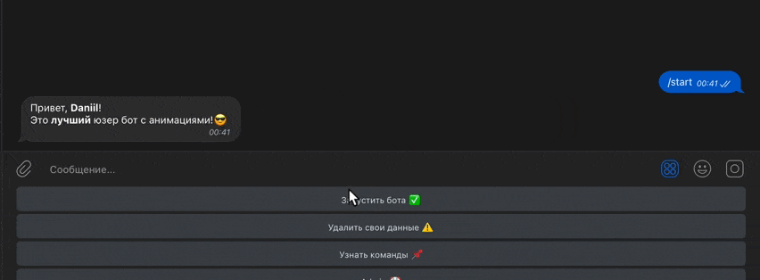

# Advanced User Telegram Bot

This is a telegram bot that creates a user bot for each user.
The user bot allows you to use custom animations in any chat. 
Animations are divided into paid and free

--------

## Example:

## Tech Stack 💻

- **Languages:**
  - Python 3.10
- **Telegram:**
  - [Aiogram](https://docs.aiogram.dev/en/latest/) - for main bot
  - [Pyrogram](https://docs.pyrogram.org/) - for user bot
- **Database:**
  - Sqlite3
  - [Sqlalchemy](https://docs.sqlalchemy.org/en/14/)
- **Payment:**
  - [Yookassa](https://yookassa.ru/developers)
- **Debug:**
  - Pylint
  - Loguru
--------

## Installation 💾

[QUICK START](markdown/quick_start.md?)

--------

## Code Guide👋 

[GUIDE](markdown/examples.md?)

--------
